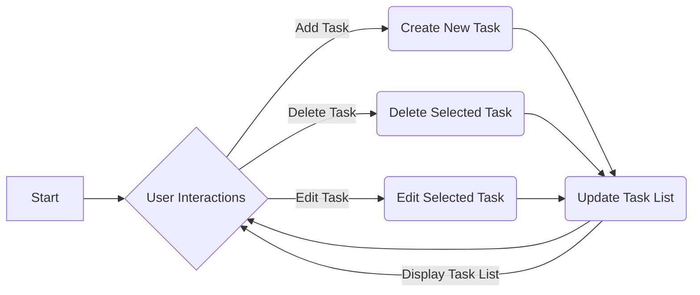

# Problem 1
Problem 1: A Todo list.\
This Todo list implements at least: 
* Creation and deletion of tasks
* Tracking done state and allowing tasks to be set to complete
* Supporting title, description, due date, completed with description and due date being mutable (note also requirement to change completion status above)
* Displaying a list of tasks
* Toggling whether all tasks or only incomplete tasks are displayed
This program is primarily intended to demonstrate a GUI, alongside all of the other features listed above. The GUI will be implemented using WPF.

Application Overview:
The WPF application is a Todo list manager that allows users to create, delete, and edit tasks. It provides a graphical user interface (GUI) for managing tasks and supports features such as tracking the task's completion status, displaying task details, and filtering tasks based on completion status.

## Design 
### UI Design
User Interface (UI):
The UI of the application is designed using XAML, which allows for creating a visually appealing and interactive interface. The main window consists of the following UI elements:
* Title, Description, Due Date input fields: TextBlocks and TextBoxes for entering task details.
* "Add Task" button: Allows users to add a new task with the provided details.
* Task list: A ListBox to display the list of tasks.
* Task item template: A DataTemplate used to define the visual representation of each task in the ListBox.
* Checkboxes: Allows users to mark tasks as completed or incomplete.
* "Delete" and "Edit" buttons: Allows users to delete or edit selected tasks.

The application provides basic functionality for managing tasks, such as adding, editing, deleting, and filtering tasks. The UI elements are intuitive and self-explanatory, making it easy for users to interact with the application.

### Code Design
MainWindow.xaml.cs: This file contains the code-behind logic for the main window and handles the UI interactions.
   - It initializes the task list as an ObservableCollection<Task> to store the tasks.
   - The "Add Task" button click event handler retrieves the task details from the input fields, creates a new Task object, and adds it to the taskList collection.
   - The "Delete Task" button click event handler removes the selected task from the taskList collection.
   - The "Edit Task" button click event handler opens a dialog window (`EditTaskDialog`) to edit the selected task.
   
Task class: This class represents a single task.
   - It implements the INotifyPropertyChanged interface to notify changes to UI elements.
   - The Task class has properties such as Title, Description, DueDate, and Completed, which can be accessed and modified.
   - Each property includes the OnPropertyChanged method, which raises the PropertyChanged event to notify the UI of property changes.
   
The code follows a code-behind model, where the UI logic is defined in the MainWindow.xaml.cs file. The code is organized into event handlers for various UI events, such as button clicks and selection changes.

The use of an ObservableCollection<Task> to store and bind the tasks to the list box is a good choice, as it automatically updates the UI when tasks are added or modified. The Task class implements the INotifyPropertyChanged interface to enable two-way data binding and notify the UI when task properties change.

### Flowchart:
Below is a flowchart illustrating the flow of the application:

The flowchart starts from the "Start" node and loops back to the "User Interactions" node until the user decides to exit the application. The user can perform various actions such as adding a new task, deleting a task, or editing a task, which will result in updating the task list display accordingly.

This flowchart provides a visual representation of the main flow of the application, highlighting the interactions between 

## Feedback of Design
   
I recived feeback from charlie stating that:\
[Monday 20:30] Charlie Smith\
Overall, it's a good design that's easy and simple to use. One thing you could consider adding is a way to show only completed tasks.

I agree with the feedback i recvived from charlie about adding a way to see only the completed tasks only.
Along side the already existing filters i added a third that allows you to see only completed tasks.

## Test 
Test 

|  Test number | Purpose of test  | Test data  | Expected result  | Actual result  |  Comments |
|---|---|---|---|---|---|
| 1 |  Test if add task is working | Tittle = Get Milk / Description = Buy Milk / Due date = 2/03/2024 | Adds Get Milk to task list  | Its workings the task is added along with its description and duedate  |  Worked as expected |
| 2 |  Test to see if Deleting tasks is working | Tittle = Get Milk / Description = Buy Milk / Due date = 2/03/2024 | Task is delted from task list  | It worked and the task is delted from the task list |  Worked as expected |
| 3 |  Test to see if can edit task | Tittle = Get Milk / Description = Buy Milk / Due date = 2/03/2024 | Task is changed to new input  | Task is not changed  | it allows you to go to change it in the message box but it dosent change the task.  |
| 4 |  Redo of Test 3 after fixes |  Tittle = Get Milk / Description = Buy Milk / Due date = 2/03/2024 | Task is changed to new input  |  Task is changed to new input | Problem was fixed. had to add INotifyPropertyChanged to the task class to notify of any changes and update them. |
| 5 |  Test to see if the filters are working | One completed and one non completed task  | When clicking the button/checkbox markded Complted, only completed tasks will appear  | It worked and you can filter which task you want to see | This meets the requirments of the brief  |

## Review against specification

##  Evaluation

### Implementation of AddTask_Click:
The code correctly handles the click event of the "Add Task" button.
It retrieves the task details from the input fields and creates a new Task object.
The new task is added to the ObservableCollection, and the input fields are cleared.
The implementation meets the requirement of creating and adding tasks.

### Implementation of DeleteTask_Click:
The code handles the click event of the "Delete" button.
It removes the selected task from the ObservableCollection.
The implementation meets the requirement of deleting tasks.

### Implementation of EditTask_Click:
The code includes an "Edit" button that is enabled when a task is selected in the list box. When the button is clicked, the code opens a dialog box (EditTaskDialog.ShowDialog) to edit the selected task's title, description, and due date. If a valid task object is returned from the dialog, the selected task is updated with the edited values.

The code meets this requirement by checking for a selected task, calling the ShowDialog method to open the dialog box for editing, and updating the task if a valid edited task is returned.
   
### Implementation of Filters
The code provides three radio buttons, "All Tasks", "Incomplete Tasks" and "Completed Tasks" for filtering the displayed tasks. When a radio button is checked, the code updates the list box's ItemsSource property to display the correct filter.

The code fulfills this requirement by handling the radio button's Checked event and updating the ItemsSource property of the list box accordingly.
   
### Implemetation of display
The code binds the tasks collection to the list box's item template, displaying each task's title, description, due date, and completion status. Users can mark tasks as completed by checking the corresponding checkbox.

The code meets this requirement by defining an item template in XAML and binding the tasks collection to the list box.

### Implementation of Task class
The Task class represents a single task and implements the INotifyPropertyChanged interface.
It includes properties for Title, Description, DueDate, and Completed.
   
Overall, the provided code satisfies the requirements previously given. It allows users to add, edit, and delete tasks, as well as filter and display tasks based on their completion status. The tasks are displayed in a list box, and the code ensures that changes to the tasks are reflected in the UI through data binding.
