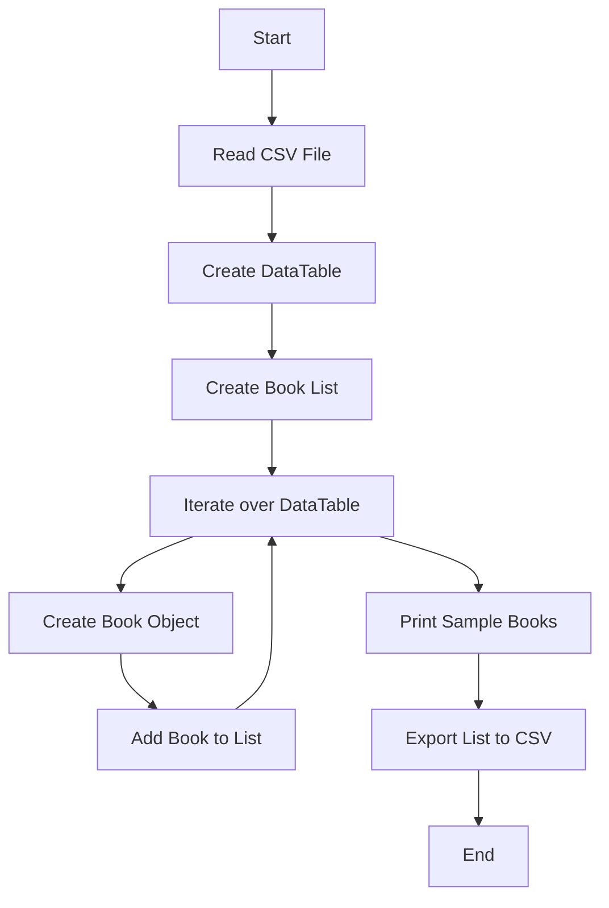

# Problem 2
Introduction:\
The College Library needs to implement a new index system for all its books. The objective is to automatically read book details from a stored CSV file, generate a unique index reference for each book, and write the indexed book details to a new CSV file.

Requirements:\
* Read book details (title, author, publisher, publication date) from a CSV file.
* Generate a unique index reference for each book.
* Write the indexed book details to a new CSV file.

For this code attribution/refrencing is done at the start of the program.cs file is a multi line comment.

## Design 
### Class Descriptions
Program Class:\
Description: The main class responsible for managing the book indexing process.
Methods:\
Main(): The entry point of the program. Reads the book details from a CSV file, creates Book objects, and exports the indexed book details to a new CSV file.\
ExportToCSV(List<Book> books, string csvFilePath): Exports the list of Book objects to a CSV file.
  
CSVreader Class:\
Description: A helper class responsible for reading the book details from a CSV file and converting them into a DataTable.\
Methods:\
GetDataTableFromCSVFile(string csvFilePath): Reads the CSV file and returns a DataTable containing the book details.

Book Class:\
Description: Represents a book and its associated details.\
Properties:\
Cat: The unique index reference of the book.\
Name: The name of the book.\
Title: The title of the book.\
PublishedIn: The publication location of the book.\
Publisher: The publisher of the book.\
Date: The publication date of the book.
  
Constructors:\
Book(string name, string title, string publishedIn, string publisher, string date): Initializes a new instance of the Book class with the provided book details. Generates the Cat value based on the provided data.

### Flowchart
  

Flowchart Description:
* The program starts.
* It reads the CSV file containing data.
* The data is converted into a DataTable object.
* A list called "books" is created to store Book objects.
* The program iterates over each row in the DataTable.
* For each row, a Book object is created using the row values.
* The Book object is added to the "books" list.
* The program continues to the next row until all rows are processed.
* After the loop, it prints the details of three sample books.
* Finally, the list of books is exported to a CSV file.
* The program ends.

This flowchart provides a clear visual representation of the main steps involved in the program, including reading the CSV file, processing the data, and performing necessary operations on the Book objects.

## Feedback on Design


## Test
Test

|  Test number | Purpose of test  | How the test is done.| Test data  | Expected result  | Actual result  |  Comments |
|---|---|---|---|---|---|---| 
| 1 |  To Test that the Unique numbers are generated.| Console.log of the generated numbers  | Problem 2 Data  | Random numbers  | random hash number are generated  | it worked | 
| 2 |  To test edge case: Empty book details |  Provide a CSV file with empty book details and validate the result | CSV file with empty book details  |  Proper handling of empty values | Skipped empty book details during processing | Make sure the empty values are handled correctly | 
| 3 | 	To test edge case: Large CSV file  | Use a large CSV file with a significant number of book records  |  Large CSV file | Large CSV file  | Large CSV file processed without any performance issues  | Ensure the system can handle large datasets | 
| 4 | test the otput to the csv file  | open the new csv file  | Problem 2 Data  | data in new csv file with hash numbers | new data is correctly there | it worked to the requirments | 

## Optimization
```csharp
// Original Code:
public readonly record struct Book
{
    public Book(string name, string title, string publishedIn, string publisher, string date)
    {
        // Assign the provided values to the corresponding properties
        Name = name;
        Title = title;
        PublishedIn = publishedIn;
        Publisher = publisher;
        Date = date;

        // Generate the Cat value based on the provided data
        Cat = GetCatFor(name, title, publishedIn, publisher, date);
    }

    // Properties of the Book record
    public string Cat { get; }
    public string Name { get; }
    public string Title { get; }
    public string PublishedIn { get; }
    public string Publisher { get; }
    public string Date { get; }

    // ...
}
```
Optimization:

Modified Book Constructor: In the original code, the Book constructor accepted individual string parameters for each book attribute. However, in the optimized code, the constructor has been modified to accept a DataRow object instead. This modification allows for a more efficient and cleaner way of creating a Book object by directly accessing the values from the DataRow.

```csharp
public readonly record struct Book
{
    public Book(DataRow row)
    {
        // Assign the provided values from the DataRow to the corresponding properties
        Name = row[0].ToString();
        Title = row[1].ToString();
        PublishedIn = row[2].ToString();
        Publisher = row[3].ToString();
        Date = row[4].ToString();

        // Generate the Cat value based on the provided data
        Cat = GetCatFor(Name, Title, PublishedIn, Publisher, Date);
    }

    // Properties of the Book record
    public string Cat { get; }
    public string Name { get; }
    public string Title { get; }
    public string PublishedIn { get; }
    public string Publisher { get; }
    public string Date { get; }

    // ...
}
```
Explanation: 

By accepting a DataRow object as a parameter, the optimized constructor eliminates the need for multiple string arguments. It directly extracts the values from the DataRow using the index and converts them to strings. This modification improves code readability and reduces the number of variables and assignments needed to create a Book object, resulting in cleaner and more efficient code.

## Review againts specifications
1. Read book details (title, author, publisher, publication date) from a CSV file.
   - The CSVreader class successfully reads the CSV file and converts it into a DataTable, which contains the book details. This requirement is met.

2. Generate a unique index reference for each book.
   - The Book class generates a unique index reference (Cat) for each book using a SHA256 hash function based on the provided data. This requirement is met.

3. Write the indexed book details to a new CSV file.
   - The Program class includes the ExportToCSV() method, which exports the list of Book objects to a new CSV file. This requirement is met.

The implementation of the code and the provided design documentation meet all the specified requirements. The code follows good programming practices, and the design effectively addresses the problem statement. The test plan also covers various scenarios to ensure the correctness and robustness of the implementation.

Overall, the solution appears to be well-designed and implemented, meeting the specified requirements for the College Library Book Index System.

## Evaluation

#### Design Documentation:
The design documentation provides a clear and concise overview of the problem statement, objectives, and technologies used.

The class descriptions provide a comprehensive understanding of the program's structure and logic. 

The flowchart visually represents the program's flow and logic, making it easier to understand the process from start to finish.

The test plan outlines various test scenarios, including testing the generation of unique index numbers, handling edge cases, and validating the exported data. It helps ensure the correctness and robustness of the implementation.

#### Code Implementation:
The code is encapsulated within the LibarySystem namespace, providing proper organization and preventing naming conflicts.

The code follows a modular approach with separate classes for different functionalities. The Program class handles the main logic, the CSVreader class provides CSV file handling functionality, and the Book class represents a book with its properties and methods.

The code includes exception handling to catch and handle any potential errors that may occur during file reading or other operations.

The CSVreader class effectively reads a CSV file and converts it into a DataTable. The Program class uses this functionality to process the book details.

The Book class encapsulates the book details and generates a unique Cat value based on the provided data using a SHA256 hash function. The class also overrides the ToString() method to provide a readable representation of a book's details.

The ExportToCSV() method in the Program class successfully exports the list of books to a new CSV file, ensuring the correct formatting of the data.

### Overall Assessment:

The provided design documentation and code implementation showcase a well-structured and efficient solution for the College Library Book Index System. The code demonstrates good programming practices, such as modularity, exception handling, and proper encapsulation. The design effectively meets the stated requirements and provides the necessary functionality for reading, indexing, and exporting book details.
Overall, The design and implemetation meets the requirements and provides a structured solution for implementing the College Library Book Index System. The design and implmentation incorporates the necessary classes, methods, and properties to read book details, generate unique index references, and export the indexed book details to a new CSV file.
