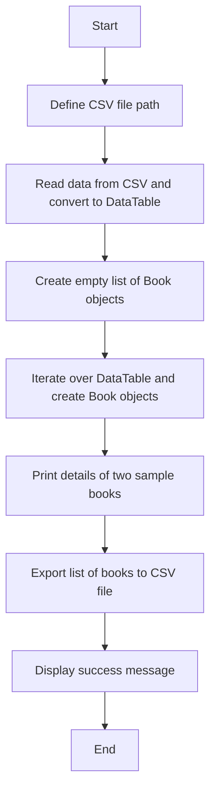

# Problem 2
Introduction:\
The College Library needs to implement a new index system for all its books. The objective is to automatically read book details from a stored CSV file, generate a unique index reference for each book, and write the indexed book details to a new CSV file.

Requirements:\
* Read book details (title, author, publisher, publication date) from a CSV file.
* Generate a unique index reference for each book.
* Write the indexed book details to a new CSV file.

## Design 
### Class Descriptions
Program Class:\
Description: The main class responsible for managing the book indexing process.
Methods:\
Main(): The entry point of the program. Reads the book details from a CSV file, creates Book objects, and exports the indexed book details to a new CSV file.\
ExportToCSV(List<Book> books, string csvFilePath): Exports the list of Book objects to a CSV file.
  
CSVreader Class:\
Description: A helper class responsible for reading the book details from a CSV file and converting them into a DataTable.\
Methods:\
GetDataTableFromCSVFile(string csvFilePath): Reads the CSV file and returns a DataTable containing the book details.

Book Class:\
Description: Represents a book and its associated details.\
Properties:\
Cat: The unique index reference of the book.\
Name: The name of the book.\
Title: The title of the book.\
PublishedIn: The publication location of the book.\
Publisher: The publisher of the book.\
Date: The publication date of the book.
  
Constructors:\
Book(string name, string title, string publishedIn, string publisher, string date): Initializes a new instance of the Book class with the provided book details. Generates the Cat value based on the provided data.

### Flowchart
  

## Test
Test

|  Test number | Purpose of test  | How the test is done.| Test data  | Expected result  | Actual result  |  Comments |
|---|---|---|---|---|---|---| 
| 1 |  To Test that the Unique numbers are generated.| Console.log of the generated numbers  | Problem 2 Data  | Random numbers  | random hash number are generated  | it worked | 
| 2 |  To test edge case: Empty book details |  Provide a CSV file with empty book details and validate the result | CSV file with empty book details  |  Proper handling of empty values | Skipped empty book details during processing | Make sure the empty values are handled correctly | 
| 3 | 	To test edge case: Large CSV file  | Use a large CSV file with a significant number of book records  |  Large CSV file | Large CSV file  | Large CSV file processed without any performance issues  | Ensure the system can handle large datasets | 
| 4 | test the otput to the csv file  | open the new csv file  | Problem 2 Data  | data in new csv file with hash numbers | new data is correctly there | it worked to the requirments | 

## Evaluation
The proposed design meets the requirements and provides a structured solution for implementing the College Library Book Index System. The design incorporates the necessary classes, methods, and properties to read book details, generate unique index references, and export the indexed book details to a new CSV file.

The Book class encapsulates book details and generates the Cat value based on the provided data. It ensures data integrity and consistency.

The CSVreader class provides a reusable component for reading CSV files and converting them into a DataTable. It handles file I/O operations and error handling.

The main BookMinder class orchestrates the book indexing process.

